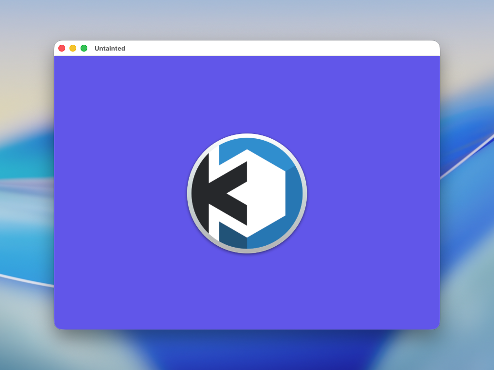
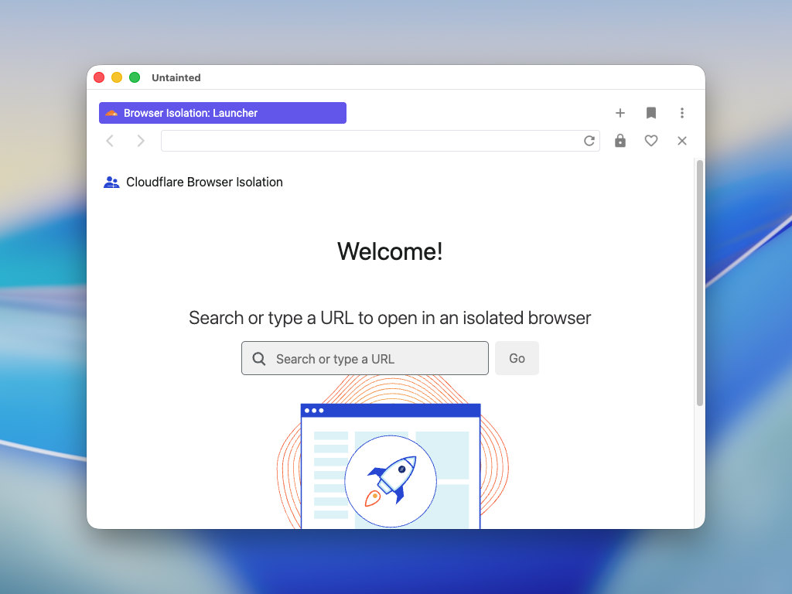
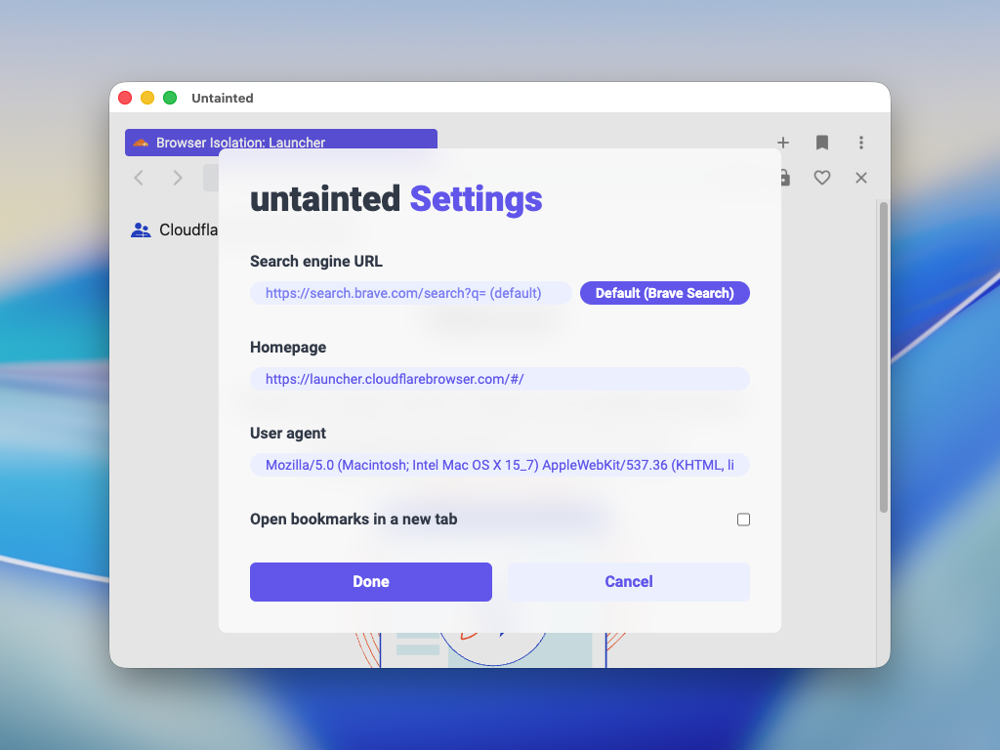

# untainted


<p align="center">
  
  
  
  <br>
  <a href="https://www.producthunt.com/posts/untainted?utm_source=badge-featured&utm_medium=badge&utm_souce=badge-untainted" target="_blank"></a>
</p>

untainted is a isolated, fast, and beautiful web browser that's created with Electron and styled with Tailwind CSS. Enjoy a clean and unique experience while surfing the web.

In this age where many browsers track their users, it's nice to have a break from telemetry and browse privately. untainted never collects any data, and is 100% telemetry free!

New things are constantly being added to untainted, so be on the lookout for new releases. You can view some features and fixes that are in the works on [this board](https://github.com/iiinvent/untainted/projects/1).

## Screenshots






## Development
```bash
# Prerequisites
- Node.js (>= 20.11.0)
- npm (>= 10.11.0)
- pnpm (>= 9.16.0)

# Clone the repo
git clone https://github.com/iiinvent/untainted.git
cd untainted

# Install the dependencies
pnpm install

# Start the app
pnpm dev
# This runs `npm start` and `npm run tailwind` concurrently
```

## Building the app
```bash
# Clone the repo
git clone https://github.com/iiinvent/untainted.git
cd untainted

# Install the dependencies
pnpm install

# Make the app
pnpm make

# The built app should be located at `./out/make/{filetype}/{architecture}/{filename}.{filetype}`
# Eg. `./out/make/deb/arm64/untainted_1.0.0_arm64.deb`
```
